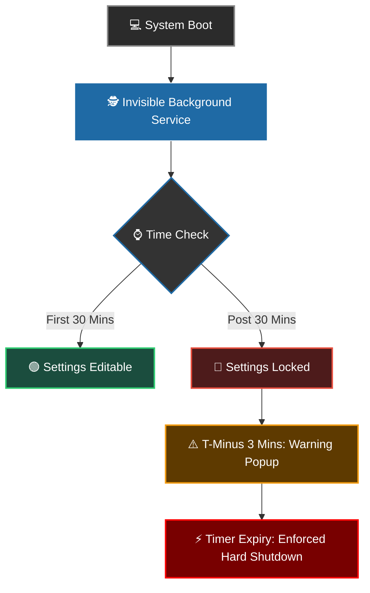

<div align="center">


# ⏱️ System Timer

### An unbypassable, automated background workstation management utility developed by **A.L.X.**


<br/>


<br/>


</div>

---

## 📌 Project Overview

**System Timer** is a specialized production-security utility designed to enforce time management protocols directly at the OS level. It runs completely hidden in the background, allowing users to pre-define screen-time limits. Once deployed, the enforcement logic uses administrative rights to block standard user bypass strategies, ensuring the workstation safely commits and shuts down when thresholds are met.

<div align="center">

```
┌──────────────────────────────────────────────┐
│   BOOT → MONITOR → LOCK → WARN → SHUTDOWN     │
└──────────────────────────────────────────────┘
```

</div>

---

## 🚀 Key Features

<table>
<tr>
<td width="50%" valign="top">

### 🕵️ Invisible Background Execution
Operates seamlessly behind the scenes without distracting system tray icons or taskbar elements.

### 🔒 Grace Window & Secure Lockout
Allows full configuration adjustments within the first **30 minutes** of system boot. Afterward, the controls lock permanently until the next restart.

</td>
<td width="50%" valign="top">

### ⚡ Unbypassable Root Shutdown
Employs forced Windows shell execution (`shutdown /s /f /t 0`) preventing termination via conventional Task Manager operations.

### ⚠️ Prompt Warning Notification
Displays a high-visibility, closeable countdown overlay exactly **3 minutes** before shutdown, giving users time to save valuable progress.

</td>
</tr>
<tr>
<td colspan="2" valign="top">

### 📦 Native OS Packaging
Features a streamlined `.exe` bundle alongside an automated **Inno Setup** compiler for clean installations and full system uninstalls.

</td>
</tr>
</table>

---

## 🛠️ Architecture & Flow



---

## ⚙️ Built With

<div align="center">


</div>

| Component | Purpose |
|---|---|
| **Python 3.x** | Core logical service execution |
| **CustomTkinter** | Modern, premium dark-blue themed GUI components |
| **PyInstaller** | Compilation framework for cross-platform binary deployment |
| **Inno Setup Compiler** | Deployment automation script creating complete startup shortcuts and registry hooks |

---

## 💾 Installation & Setup

### ✅ Prerequisites
Ensure you have Windows 10/11 with local Administrator privileges.

### 🧩 Standard Deployment (Recommended)

1. Download the latest `System_Timer_Setup.exe` from the **Releases** tab.
2. Run the setup wizard (Fully branded by **A.L.X.** including licensing data).
3. The application will immediately bind to your `shell:startup` sequence.

### 🧑‍💻 Local Development Setup

If you plan to test or run the source files directly:

```bash
# Clone the repository
git clone https://github.com/your-username/System-Timer.git

# Navigate into the project directory
cd System-Timer

# Install dependencies
pip install customtkinter

# Run the app structure
python app.pyw
```

To compile your own executable with custom graphical icons:

```bash
pip install pyinstaller
pyinstaller --noconsole --onefile --icon=app_icon.ico app.pyw
```

---

## 🎯 How It Works (User Guide)

<table>
<tr>
<td width="33%" align="center">

**🔍 Accessing the App**

Because the window hides on launch, tap the `Windows Key` and search for **"System Timer"** to reveal the GUI dashboard.

</td>
<td width="33%" align="center">

**🎛️ Setting the Constraint**

Use the professional slider layout to shift runtime parameters (ranging from 35 to 180 minutes). Click **Save Settings**.

</td>
<td width="33%" align="center">

**🗑️ Safe Removal**

If you wish to suspend the service, simply uninstall it natively via `Apps > Installed Apps`. The uninstaller instantly flushes out background registries and shortcuts.

</td>
</tr>
</table>

---

## 📜 License & Copyright

<div align="center">

**Copyright (c) 2026 A.L.X. All Rights Reserved.**


</div>
